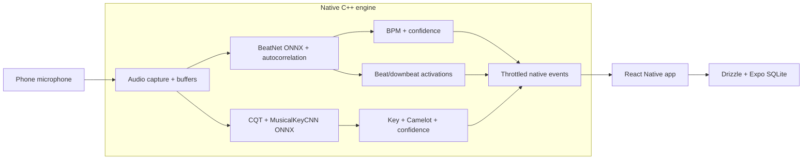

# Keyed

**On-device BPM and key detection for DJs cataloging vinyl.**

Keyed is a mobile app that listens through the phone microphone and estimates BPM, musical key, Camelot code, and confidence without uploading audio or relying on a backend. I built it to catalog a vinyl collection the way DJ software catalogs digital files: play a record, capture its tempo/key, and keep the result available for mixing later.

The app is Expo React Native on the surface, but the hard part is a custom native C++ analysis engine that keeps microphone buffers, feature extraction, and ONNX inference off the JavaScript thread.


## What it does

- **Catalog records.** Play through vinyl, save BPM/key/Camelot results locally, and label sleeves for fast harmonic mixing at a gig.
- **Read live audio.** Point it at vinyl, CDJs, or any room audio to estimate the current track's tempo and key.
- **Work offline.** Audio stays on device. There is no account, upload step, or network dependency.

## Why it is technically interesting

- **Native real-time audio path.** The C++ engine owns capture, buffering, DSP, and inference. React Native receives throttled state events instead of raw audio buffers.
- **Fine-tuned BPM model.** The BPM path uses BeatNet exported to ONNX, retrained on electronic music with phone-mic augmentation and a differentiable autocorrelation tempo loss.
- **DJ-aware stabilization.** Autocorrelation post-processing and half/double-time correction keep tempo estimates in the range DJs actually mix in, instead of bouncing between values like 87 and 174.
- **Parallel key detection.** A CQT + CNN pipeline estimates musical key and Camelot code from the same native audio stream.
- **Local-first persistence.** Detection history is stored with Drizzle and Expo SQLite so the app becomes a searchable catalog, not just a live meter.

## Architecture

A Bun monorepo: an Expo React Native app on a shared native analysis engine.

```text
apps/native       Expo Router mobile app
packages/engine   Expo native module, C++ DSP, ONNX inference, iOS/Android bridges
packages/db       Drizzle schema and Expo SQLite hooks
packages/config   Shared configuration files
```

Three analysis pipelines run off the JS thread:



## Limitations

- BPM is optimized for DJ/electronic music with clear rhythmic structure.
- Key detection is a rolling estimate; it is not instant and becomes more stable with longer listening windows.
- Phone microphones and room acoustics vary, so confidence is shown as part of the result instead of hiding uncertainty.

## Deep dives

- [Engine architecture](packages/engine/docs/architecture.md)
- [BeatNet BPM implementation](packages/engine/docs/beatnet.md)
- [Key detection implementation](packages/engine/docs/key-detection.md)
- [Native engine module](packages/engine/README.md)

## Stack

React Native 0.81 · Expo 54 · React 19 · TypeScript · Bun · Turborepo · Reanimated · Skia · react-native-unistyles · C++ DSP · ONNX Runtime · Drizzle + Expo SQLite

## Running locally

```bash
git clone https://github.com/jmcmullen/keyed.git
cd keyed
bun install
bun run dev
```

Requires the standard iOS or Android toolchain.

## Verification

```bash
bun run check   # Biome lint/format + Turbo type checks
bun run test    # native app Bun tests + engine C++ tests
```

## License

MIT, see [LICENSE](LICENSE). Built by Jay McMullen.
