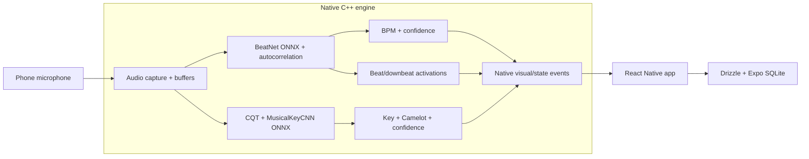

# Keyed

**Play a record. Keyed tells you its tempo and key. No internet required.**

Every DJ who has ever lugged a crate of vinyl knows the problem. Digital files turn up neatly labelled with their BPM and key. Records turn up with none of that. So you either commit the lot to memory, or you guess at the worst possible moment, halfway through a mix with a full floor watching.

Keyed listens through your phone's microphone and works it out for you: BPM, musical key, Camelot code, and an honest measure of how sure it is. Nothing leaves the device. Play the record, capture the result, and it is sitting in your catalogue when you need it at the gig.

On the surface it is an Expo React Native app. The interesting part is underneath: a custom C++ engine that does the listening, the maths, and the inference, all kept well clear of the JavaScript thread where it would only cause trouble.


## What it actually does

- **Builds you a catalogue.** Play through your vinyl, save the BPM, key, and Camelot code for each record, and label your sleeves so harmonic mixing at a gig is a glance rather than a gamble.
- **Reads the room live.** It does not care where the sound comes from, vinyl, CDJs, or the house system. Hold the phone up to the speakers and it estimates the current track's tempo and key on the spot.
- **Works with the wifi off.** No account, upload, or network dependency.

## The art and the science

The romance is reading a record in seconds. The work is everything that has to happen for that to be true.

- **The listening happens in C++, not JavaScript.** The native engine owns capture, buffering, DSP, and inference. React Native is handed tidy, throttled state events, never the raw audio. That is the difference between a meter that keeps up with the music and one that stutters.
- **The tempo model was taught to listen like this.** The BPM path uses BeatNet exported to ONNX, retrained on electronic music with phone-microphone augmentation and a differentiable autocorrelation tempo loss. In plain terms, it was trained on the kind of audio it will actually hear, picked up through the kind of microphone it will actually use.
- **It knows the difference between 87 and 174.** Anyone who has used a cheap BPM counter knows its favourite mistake: reading a track at double or half its real tempo, so a 174 comes back as an 87. Autocorrelation post-processing and half/double-time correction keep the number in the range DJs genuinely mix in, instead of flipping between the two and making you doubt it.
- **The key gets worked out in parallel.** A separate CQT and CNN pipeline reads musical key and Camelot code off the same native audio stream, at the same time, without getting in the tempo path's way.
- **Every reading is kept.** Detection history is stored locally with Drizzle and Expo SQLite, so the app quietly turns into a searchable catalogue rather than a live meter you have to babysit.

## How it is put together

A Bun monorepo: an Expo React Native app sitting on a shared native analysis engine.

```text
apps/native       Expo Router mobile app
packages/engine   Expo native module, C++ DSP, ONNX inference, iOS/Android bridges
packages/db       Drizzle schema and Expo SQLite hooks
packages/config   Shared configuration files
```

The audio path runs off the JS thread, with BPM and key detection fed from the same microphone:



## Where it draws the line

No tool reads everything, and a tool that pretends to is worse than one that is honest. So:

- BPM is tuned for DJ and electronic music with a clear rhythmic backbone. Give it a string quartet and it has nothing to hold onto.
- Key is a rolling estimate, not an instant verdict. Give it a longer listen and it settles.
- Phone microphones and room acoustics are not consistent, so confidence is shown as part of the result. Keyed tells you how sure it is rather than hiding the doubt and hoping you do not notice.

## Read further

- [Engine architecture](docs/architecture.md)
- [BPM detection implementation](docs/bpm-detection.md)
- [Key detection implementation](docs/key-detection.md)
- [Native engine module](packages/engine/README.md)

## What it is built on

React Native 0.81 · Expo 54 · React 19 · TypeScript · Bun · Turborepo · Reanimated · Skia · react-native-unistyles · C++ DSP · ONNX Runtime · Drizzle + Expo SQLite

## Getting it running

```bash
git clone https://github.com/jmcmullen/keyed.git
cd keyed
bun install
bun run dev
```

You will need the usual iOS or Android toolchain in place.

## Capturing dev logs

The normal dev commands write logs to `.logs/`: Metro reporter events in `.logs/metro/`, plus structured app events in `.logs/evlog/`.

## Checking your work

```bash
bun run check   # Biome lint/format + Turbo type checks
bun run test    # native app Bun tests + engine C++ tests
```

## Licence

MIT, see [LICENSE](LICENSE).
