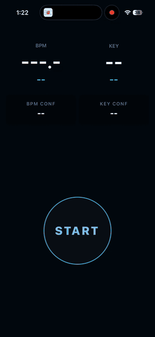

# Keyed

**DJ BPM & Key Finder**

Keyed detects the BPM and musical key of music playing around you, fully on device. It is built for DJs who need quick tempo, key, and Camelot readings while mixing vinyl, CDJs, and digital sources.

## Demo



## Features

- **Real-time BPM detection** from microphone input with DJ-range half/double tempo correction
- **Real-time key detection** with standard notation and Camelot codes
- **Confidence scoring** for BPM and key readings
- **Live waveform visualizer** while listening
- **Local history** of saved detections with swipe-to-delete and clear-all actions
- **Fully offline processing** with no server dependency
- **iOS and Android support** through Expo and native modules

## Privacy

Keyed processes microphone audio locally on the device. Audio, song information, detection history, and usage analytics are not transmitted by the app. Saved detections are stored locally in Expo SQLite.

## Monorepo

This repository is a Bun workspace managed with Turborepo.

| Path | Purpose |
| --- | --- |
| `apps/native` | Expo React Native mobile app |
| `packages/engine` | Expo native module for BPM/key analysis |
| `packages/db` | Drizzle ORM schema, migrations, and Expo SQLite hooks |
| `packages/config` | Shared TypeScript configuration |
| `docs` | Product spec and native analysis documentation |
| `scripts` | Native engine test and model comparison helpers |

## Tech Stack

- Bun workspaces and Turborepo
- Expo 54, React Native 0.81, React 19, and Expo Router
- TypeScript
- `react-native-unistyles` for styling
- React Native Reanimated and Skia for the waveform UI
- Drizzle ORM with Expo SQLite for local history
- Native C++ DSP and inference through `@keyed/engine`
- ONNX Runtime with bundled BeatNet and MusicalKeyCNN models

## Native Analysis

The mobile app talks to `@keyed/engine`, an Expo module with shared C++ analysis code and platform bridges for iOS and Android.

- BPM path: microphone audio -> resampling -> mel features -> BeatNet ONNX model -> stabilized decimal autocorrelation BPM estimate and confidence
- Key path: microphone audio -> CQT features -> MusicalKeyCNN ONNX model -> key, Camelot code, and confidence
- Bundled models live in `packages/engine/models/beatnet.onnx` and `packages/engine/models/keynet.onnx`
- The TypeScript module API is defined in `packages/engine/src/Engine.types.ts`

See [`packages/engine/README.md`](packages/engine/README.md) for the native module API and package-specific notes.

## Requirements

- [Bun](https://bun.sh) `1.2.16` or newer
- Xcode and an iOS Simulator or physical iOS device for iOS work
- Android Studio and an emulator or physical Android device for Android work
- CMake and a C++ toolchain for native engine tests
- EAS CLI for the `apps/native` EAS build scripts

## Setup

```bash
git clone https://github.com/jmcmullen/keyed.git
cd keyed
bun install
bun run dev:native
```

The app does not currently require environment variables for local offline detection. `apps/native/.env.example` is present for public Expo config if that becomes necessary.

Because the app uses native modules, use a development build or native run command when testing on devices:

```bash
bun --cwd apps/native run ios
bun --cwd apps/native run android
```

Expo build tools run prebuild automatically when native folders are missing. To install an EAS build on a simulator or device, use `eas build:run --profile development --platform ios` or the matching Android command.

## Commands

| Command | Description |
| --- | --- |
| `bun run dev` | Run all Turbo dev tasks |
| `bun run dev:native` | Start the Expo dev server for `apps/native` |
| `bun run build` | Build packages through Turbo |
| `bun run check` | Run Biome linting and formatting |
| `bun run check-types` | Typecheck all packages |
| `bun --cwd apps/native test` | Run the native app Bun tests |
| `bun run test:native` | Build and run the C++ engine test suite |
| `bun run test:native:build` | Build the C++ engine tests |
| `bun run test:native:run` | Run the already-built C++ engine tests |
| `bun run test:native:golden` | Regenerate native engine golden files |
| `bun --cwd packages/db db:generate` | Generate Drizzle migrations |
| `bun --cwd packages/db db:studio` | Open Drizzle Studio |

Additional engine-focused helpers live in `scripts/`, including model comparison, full-track testing, BeatNet testing, and streaming extractor checks.

## Build Profiles

`apps/native/eas.json` defines three EAS profiles:

| Profile | Purpose |
| --- | --- |
| `development` | Internal dev-client builds; iOS simulator and Android APK |
| `preview` | Internal preview builds |
| `production` | Store-oriented production builds with auto-incrementing versions |

App-level build scripts are defined in `apps/native/package.json`.

## Documentation

- [`docs/SPEC.md`](docs/SPEC.md) - Product and UI specification
- [`docs/ANALYSIS.md`](docs/ANALYSIS.md) - End-to-end native analysis architecture
- [`docs/BEATNET.md`](docs/BEATNET.md) - BPM pipeline internals and model notes
- [`docs/KEY_DETECTION.md`](docs/KEY_DETECTION.md) - Key-analysis pipeline internals and API
- [`packages/engine/README.md`](packages/engine/README.md) - Native engine package notes

## Project Structure

```text
keyed/
├── apps/
│   └── native/          # Expo React Native app
├── docs/                # Product and analysis docs
├── packages/
│   ├── config/          # Shared TypeScript config
│   ├── db/              # Expo SQLite + Drizzle package
│   └── engine/          # Native C++ analysis engine
└── scripts/             # Engine test/model helper scripts
```

## Contributing

1. Fork the repository.
2. Create a branch from `master`.
3. Make the change and add focused tests where behavior changes.
4. Run `bun run check-types` and the relevant test command.
5. Open a pull request with the behavior change and verification notes.

## License

Keyed is licensed under the [MIT License](LICENSE).
